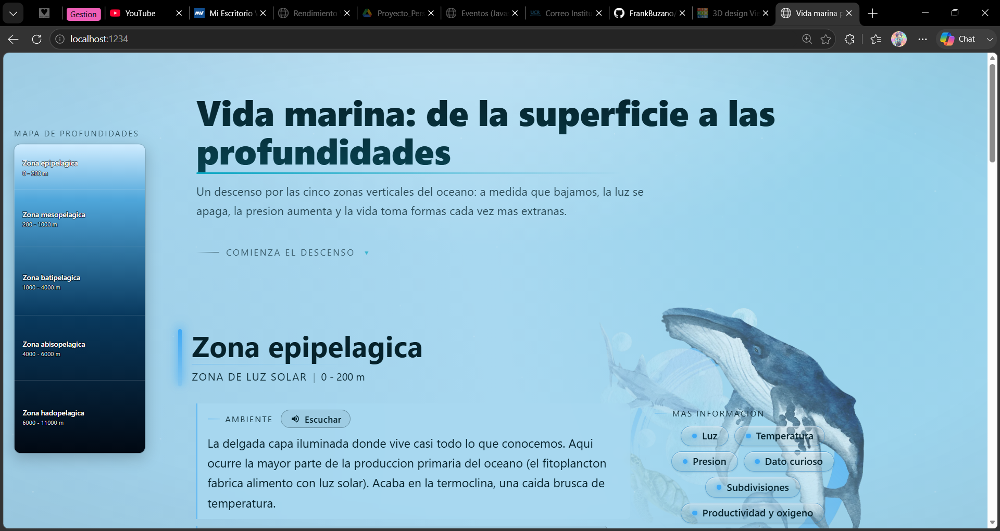
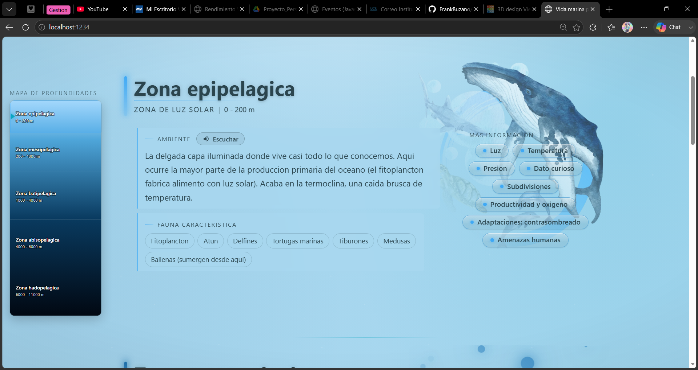
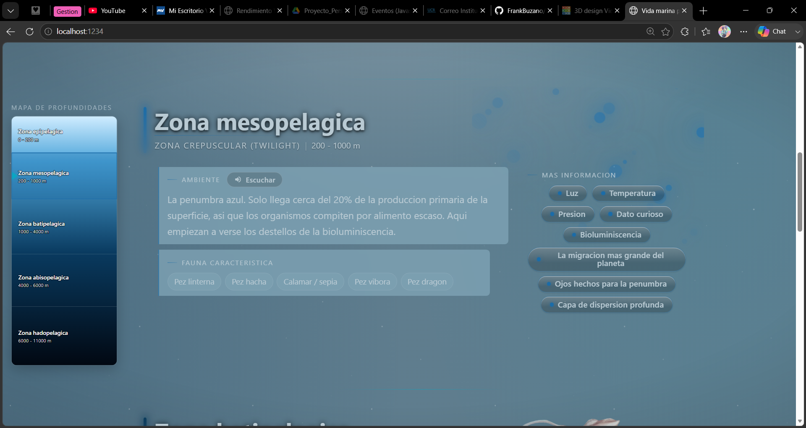
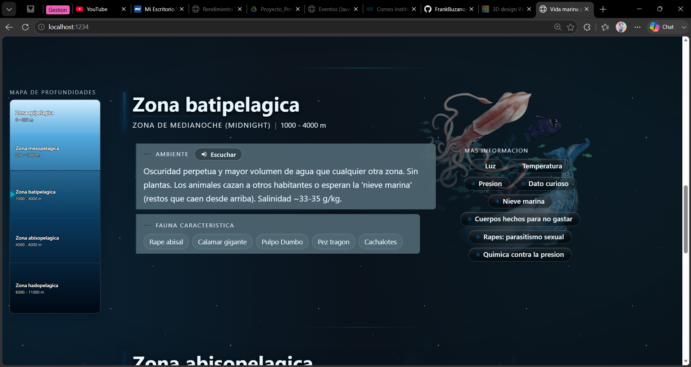
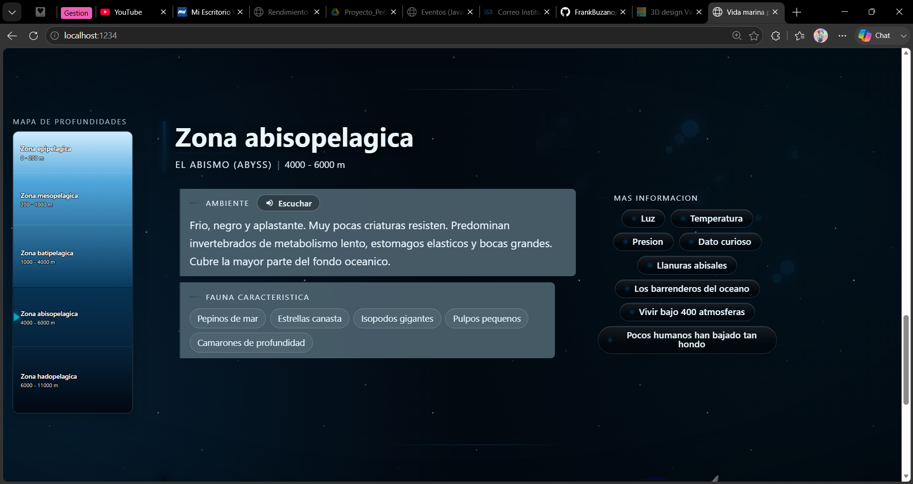
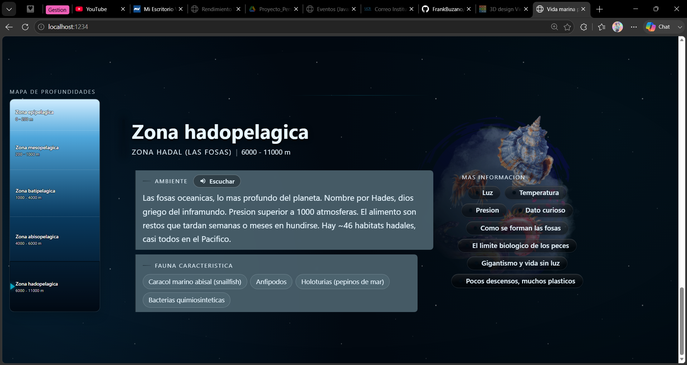

# Vida marina profunda — Infografía animada

Proyecto del curso de Multimedios. Infografía web sobre las zonas verticales del océano: a medida que el usuario desciende por la página, los colores se oscurecen, aparecen especies características de cada zona y se pueden activar narraciones de audio haciendo clic sobre cada sección.

## Framework elegido: **Vue 3**

Se usa Vue 3 con Composition API y `<script setup>`.

## Cómo ejecutar

```bash
pnpm install      # primera vez
pnpm dev          # servidor de desarrollo en http://localhost:1234
pnpm build        # build de producción a /dist
pnpm preview      # previsualizar el build
```
## Pantallazos de la página funcionando

- [x] Pantalla inicial


- [x] Zona epipelágica


- [x] Zona mesopelágica


- [x] Zona batipelágica


- [x] Zona abisopelágica


- [x] Zona hadopelágica
